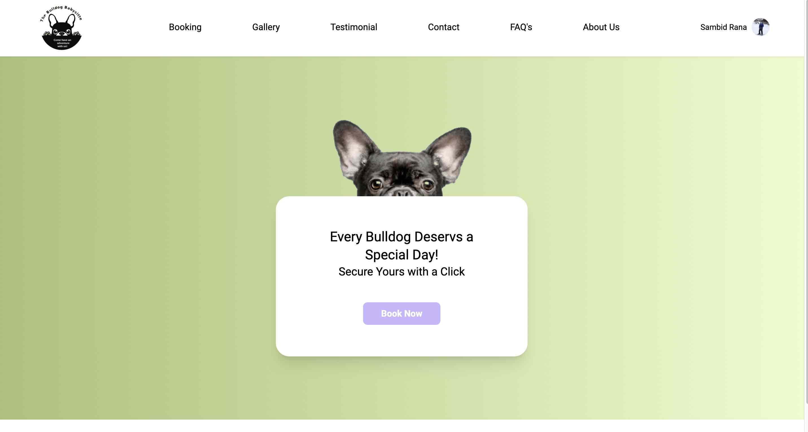
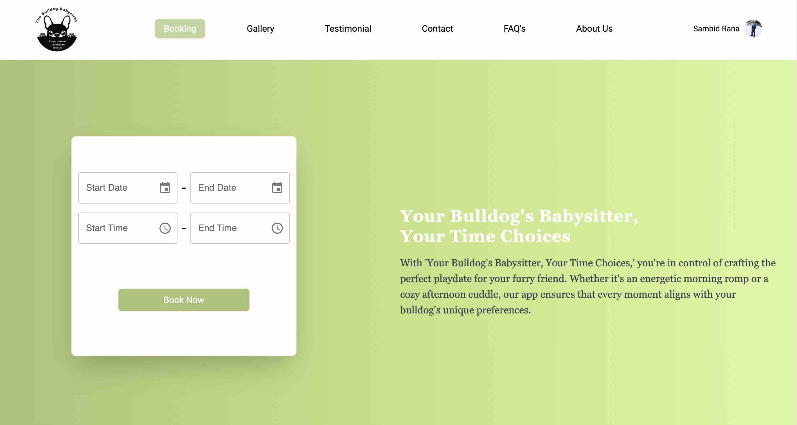
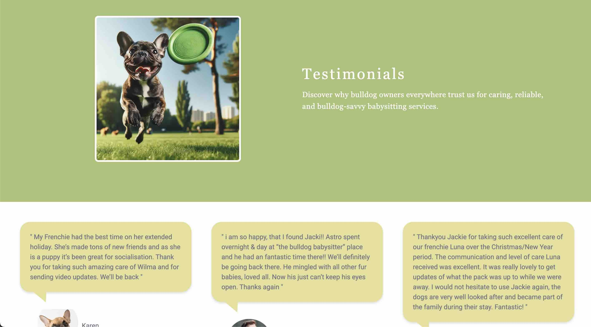
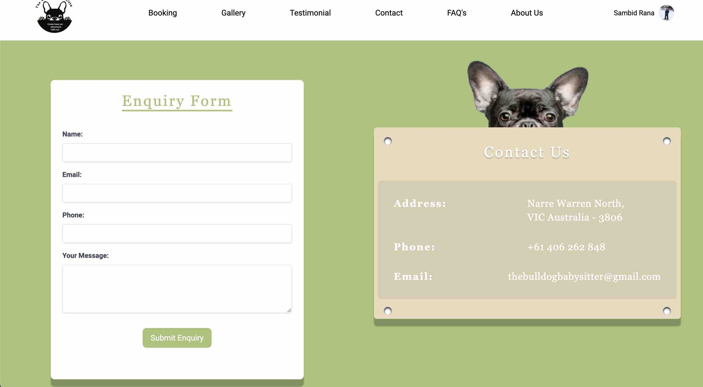
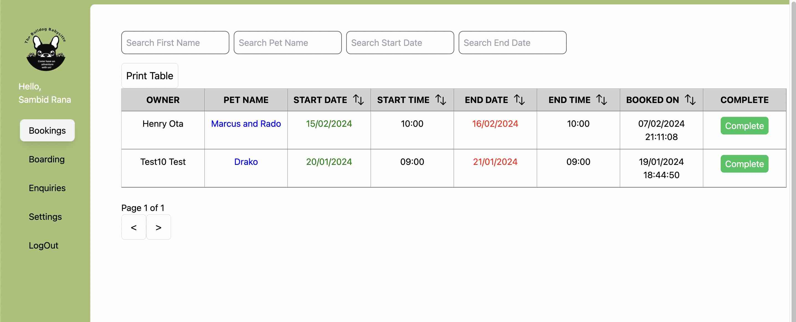
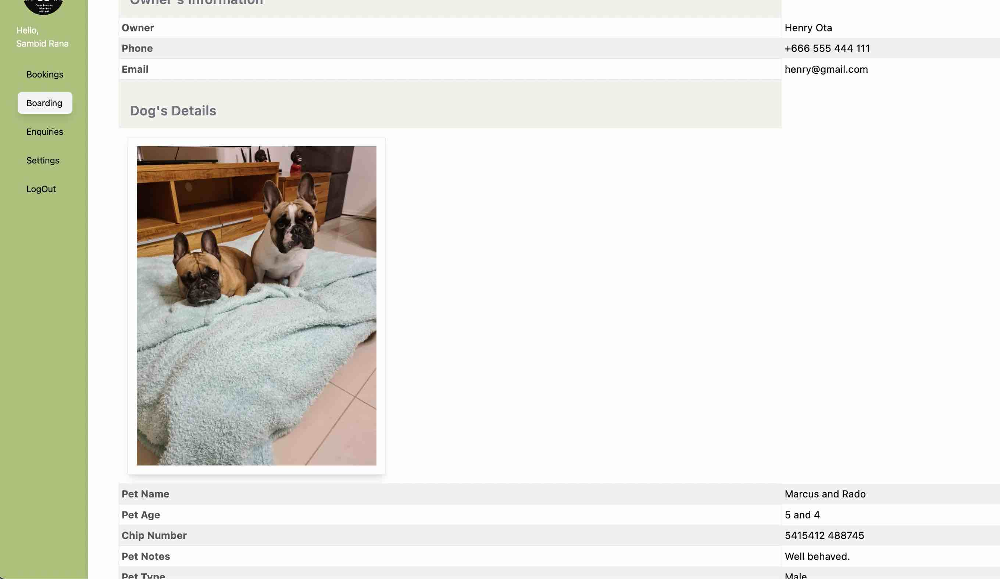
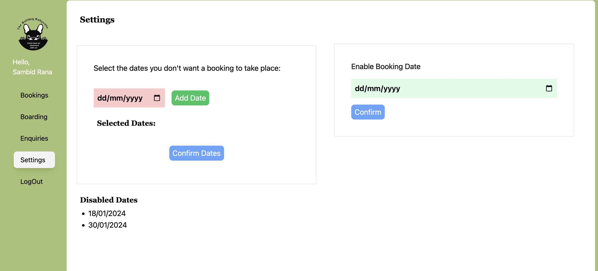

# The Bulldog Babysitter

## Overview

The Bulldog Babysitter is a custom web application built with Next.js, designed exclusively for the Bulldog Babysitter family's existing customers. This platform revolutionizes how clients book appointments online and offers an intuitive admin panel for managing bookings and boarding details efficiently.

## Key Features and Technical Highlights

### Client-Side Features

- **Homepage**: A welcoming entry point that introduces the services offered.

- **Booking Page**: Enables clients to easily book appointments with detailed forms.

- **Testimonials & Gallery**: Showcases customer testimonials and a gallery of Bulldogs enjoying their time.

- **Contact Us**: Provides a direct communication channel for inquiries or feedback.

### Admin-Side Features
https://github.com/sambidrana/bulldog-babysitter-admin
- **Booking and Boarding Management**: Comprehensive tools for admins to view booking details, manage boarding information, and customize booking availability.

### Technical Highlights

- **Next.js**: Utilizes Next.js for server-side rendering, ensuring fast load times and improved SEO.
- **Responsive Design**: Crafted with a responsive design to ensure a great user experience across all devices.
- **Security and Data Management**: Implements best practices in security and data management, ensuring that client and booking information is handled securely.

## Showcase

This project demonstrates advanced web development skills, including:

- Seamless integration of client-side and admin-side functionalities.
- Effective use of Next.js for building a performant and scalable web application.
- Attention to user experience design, ensuring that both clients and administrators have a smooth, intuitive interaction with the platform.

## Technologies Used

- **Frontend**: Next.js, React
- **Backend**: Next.js, Node.js
- **Database**: MongoDB, S3 Bucket
<!-- - **Deployment** -->

## Viewing the Project

This project is set to be hosted at [thebulldogbabysitter.com.au](http://thebulldogbabysitter.com.au). The site is currently under preparation and will be live soon. Stay tuned to explore the features and functionalities implemented once it's launched.

## Contact

For more information about this project or to discuss potential collaborations, contact Sambid Rana at sambid.rana1@gmail.com.
